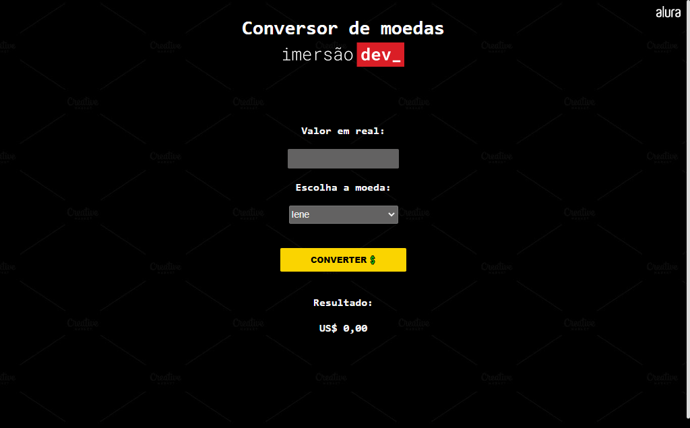

# Conversor de Moedas

> Conversor

Esse projeto de conversor de moedas foi criado na imersão dev da Alura.

[Clique para acessar](https://guimiiller.github.io/currency_converter/)

## 🚀 Tecnologias

- HTML
- CSS
- JavaScript
- Git e Github

## 💻 O que aprendi

- Aprimorei meus conhecimentos em JS
- Converter moedas com JS

## 📨 Contato

- guilhermemillerblack@gmail.com